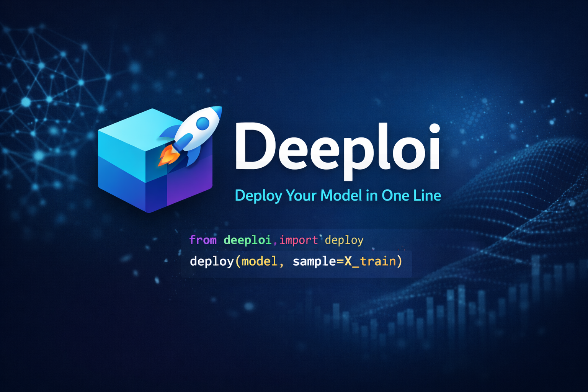
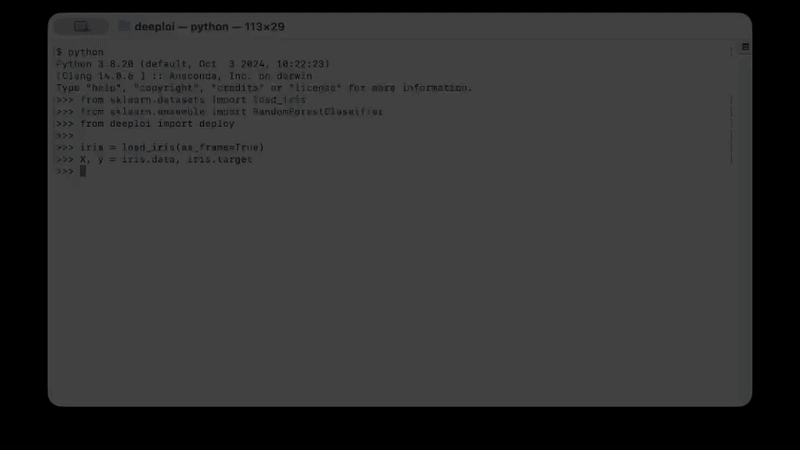

# Deeploi &mdash; Deploy ML Models in Seconds 🚀

<!-- <p align="center">
  
</p> -->



[](https://pypi.org/project/deeploi/) [](./LICENSE)

**Turn your trained tabular ML model into a production-ready API with a single line of code. No DevOps. No boilerplate. No headaches.**

## Why Deeploi?

- **Instant API:** Serve your scikit-learn-compatible, XGBoost, LightGBM, or CatBoost model in one command.
- **Zero Config:** No YAML, no Docker, no cloud lock-in.
- **Local-First:** Run on your laptop, server, or VM.
- **Built for ML work:** Focus on the model, not the serving stack.

## Install

```bash
pip install deeploi
```

## Fastest Start

```python
from sklearn.datasets import load_iris
from sklearn.ensemble import RandomForestClassifier
from deeploi import deploy

iris = load_iris(as_frame=True)
X, y = iris.data, iris.target
model = RandomForestClassifier(random_state=42).fit(X, y)

deploy(model)
```

Your model is now live at `http://127.0.0.1:8000`.

## Most Important Ways to Access Deeploi

### 1. Open the dashboard

Open this in your browser:

```text
http://127.0.0.1:8000/
```

The dashboard gives you a quick way to inspect metadata, test endpoints, and send prediction requests.

### 2. Call the prediction API directly

```bash
curl -X POST http://127.0.0.1:8000/predict \
  -H "Content-Type: application/json" \
  -d '{
    "records": [
      {
        "sepal length (cm)": 5.1,
        "sepal width (cm)": 3.5,
        "petal length (cm)": 1.4,
        "petal width (cm)": 0.2
      }
    ]
  }'
```

Core endpoints:

- `POST /predict`
- `POST /predict_proba`
- `POST /predict-csv` (optional batch file upload)
- `GET /meta`
- `GET /health`

Optional CSV batch prediction example:

```bash
curl -X POST http://127.0.0.1:8000/predict-csv \
  -F "file=@examples/iris_batch.csv"
```

For ecosystem-specific installs:

```bash
pip install "deeploi[tabular]"
pip install "deeploi[all]"
```

### 3. Work with a reusable package object

```python
from deeploi import package

pkg = package(model)
preds = pkg.predict(X.head())
pkg.serve(port=8000)
```

Use this when you want a Python object you can predict with, save, and serve explicitly.

### 4. Save and reload a model artifact

```python
from deeploi import package, load

pkg = package(model)
pkg.save("artifacts/iris_rf")

loaded = load("artifacts/iris_rf")
loaded.serve(port=8000)
```

Use this when you want a portable artifact directory you can reload later.

## Docker Artifact Generation

Use Docker generation when you want a saved artifact that is easy to move onto another machine or run in a container.

```python
from deeploi import package

pkg = package(model)
pkg.save("artifacts/iris_rf", generate_docker=True)
```

Then build and run it:

```bash
cd artifacts/iris_rf
docker build -t iris-model .
docker run --rm -p 8000:8000 iris-model
```

## Who is Deeploi for?

- Data scientists who want to share a model quickly
- ML engineers who need fast local serving for tabular models
- Teams that want a lightweight path from notebook to API

Popular tabular frameworks now include sklearn-compatible estimators (including HistGradientBoosting, ExtraTrees, and CalibratedClassifierCV), XGBoost, LightGBM, CatBoost, NGBoost, LightGBM/CatBoost rankers, and imbalanced-learn meta-estimators.

Neural network support is intentionally deferred to a future release so v0.3.x stays focused on simple tabular ML workflows.

## Learn More

See [DOCS.md](./DOCS.md) for:

- advanced `deploy`, `package`, and `load` usage
- environment-based authentication
- Docker artifact generation
- artifact layout
- error handling and testing examples

## License

MIT &mdash; see [LICENSE](./LICENSE).